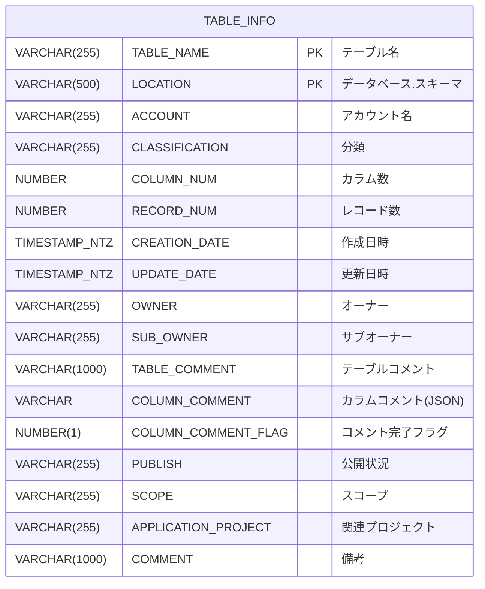
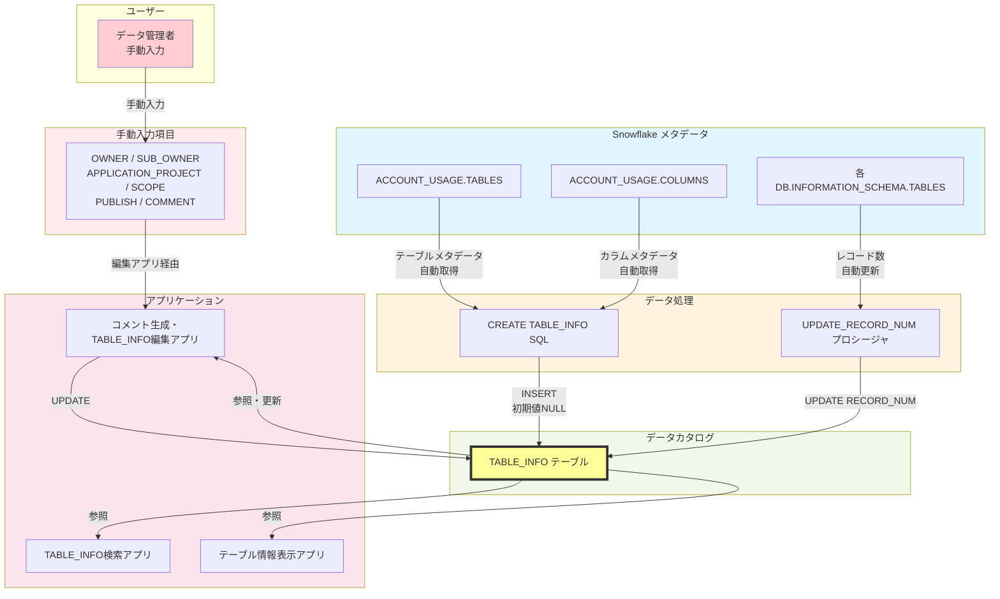
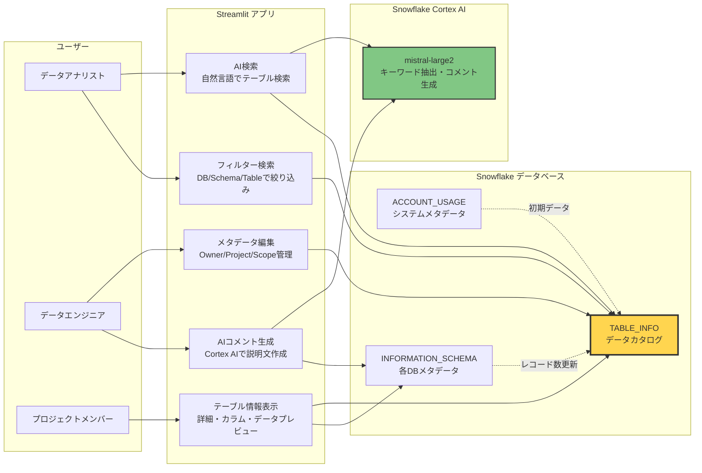
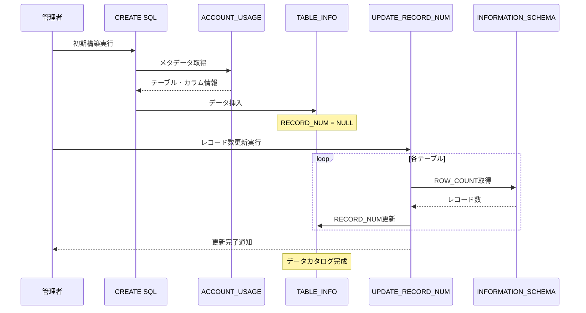
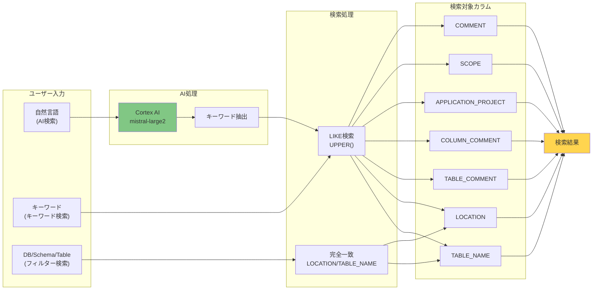

# TABLE_INFO エンティティ図

## データカタログシステム ER図



## カラム詳細説明

### 主キー
- **TABLE_NAME**: テーブル名
- **LOCATION**: データベース名.スキーマ名 (例: DIESELPJ_GEN.DATA_CATALOG)

### 自動取得項目 (ACCOUNT_USAGE / INFORMATION_SCHEMAから)
| カラム名 | データ型 | 説明 | 取得元 |
|---------|---------|------|--------|
| ACCOUNT | VARCHAR(255) | Snowflake環境名 | 固定値 (DIESELPJ) |
| CLASSIFICATION | VARCHAR(255) | DB基盤名 | 固定値 (SNOWFLAKE) |
| COLUMN_NUM | NUMBER | カラム数 | ACCOUNT_USAGE.COLUMNS |
| RECORD_NUM | NUMBER | レコード数 | INFORMATION_SCHEMA.TABLES |
| CREATION_DATE | TIMESTAMP_NTZ | テーブル作成日時 | ACCOUNT_USAGE.TABLES |
| UPDATE_DATE | TIMESTAMP_NTZ | 最終更新日時 | ACCOUNT_USAGE.TABLES |
| TABLE_COMMENT | VARCHAR(1000) | テーブルコメント | ACCOUNT_USAGE.TABLES |
| COLUMN_COMMENT | VARCHAR | カラムコメント(JSON配列) | ACCOUNT_USAGE.COLUMNS |
| COLUMN_COMMENT_FLAG | NUMBER(1) | 全カラムコメント有無 (1=完了, 0=未完了) | 計算値 |

### 手動入力項目 (NULL初期値)
| カラム名 | データ型 | 説明 | 用途 |
|---------|---------|------|------|
| OWNER | VARCHAR(255) | オーナー | 責任者名 |
| SUB_OWNER | VARCHAR(255) | サブオーナー | 副責任者名 |
| PUBLISH | VARCHAR(255) | 公開状況 | 公開/非公開など |
| SCOPE | VARCHAR(255) | スコープ | 利用範囲・用途 |
| APPLICATION_PROJECT | VARCHAR(255) | 関連プロジェクト | プロジェクト名 |
| COMMENT | VARCHAR(1000) | 備考 | 自由記述欄 |

## COLUMN_COMMENT JSON形式

```json
[
  {
    "column": "カラム名1",
    "comment": "カラムの説明1"
  },
  {
    "column": "カラム名2",
    "comment": "カラムの説明2"
  }
]
```

## データフロー図



## システムアーキテクチャ



## データ更新フロー



## 検索機能の仕組み



---

## 備考
- 作成日: 2025-12-11
- データベース: DIESELPJ_GEN.DATA_CATALOG
- 主な用途: データカタログ、テーブル検索、メタデータ管理
- AI機能: Snowflake Cortex AI (mistral-large2) 使用
